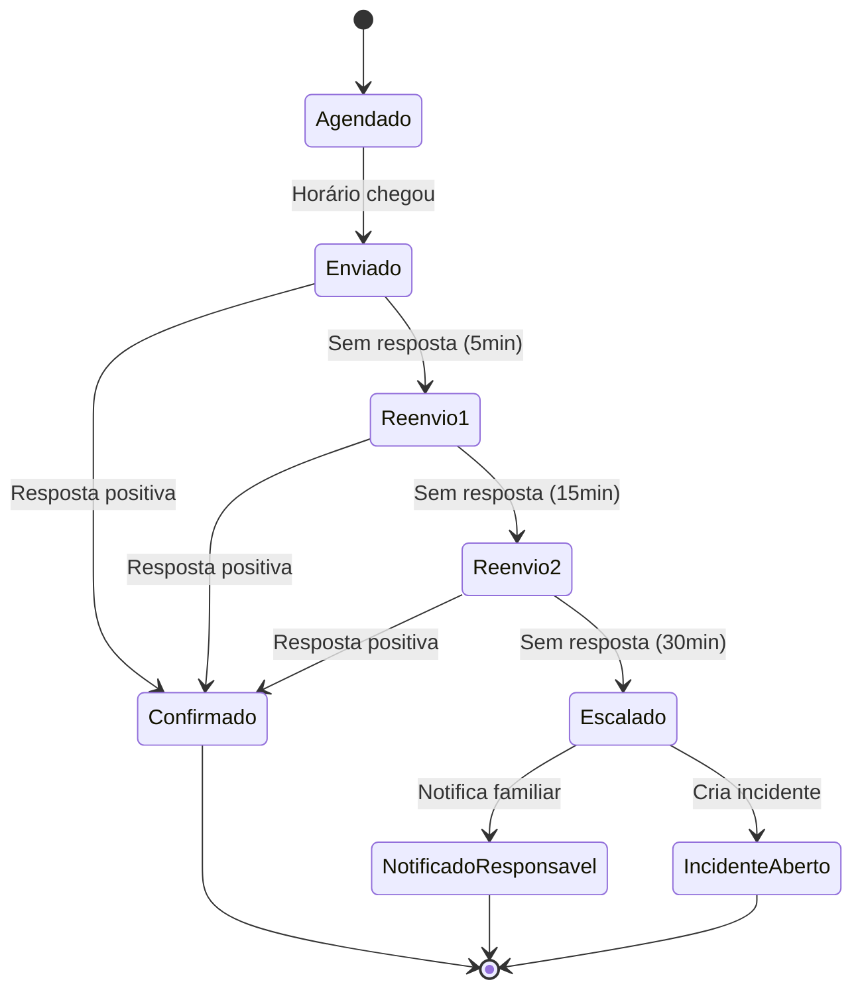
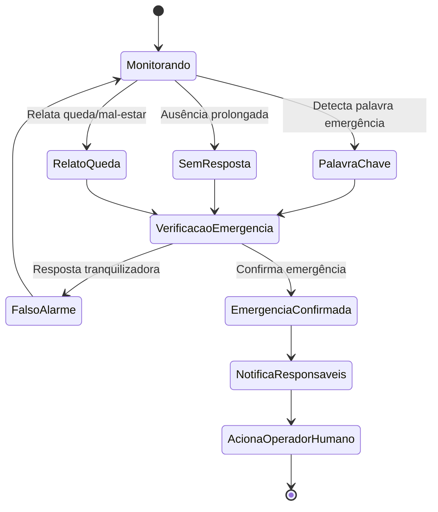

# TôBem - Plataforma de Suporte a Idosos via WhatsApp com n8n

## 📋 Visão Geral

O **TôBem** é uma plataforma inovadora que utiliza **n8n como cérebro de orquestração** junto com WhatsApp Business API para oferecer suporte contínuo a pessoas idosas, permitindo que familiares acompanhem e cuidem de seus entes queridos de forma proativa e carinhosa.

### 🎯 Objetivo Principal
Facilitar o cuidado e monitoramento de idosos através de:
- **Lembretes automáticos** para medicação, consultas e atividades
- **Detecção de emergências** através de palavras-chave e ausência prolongada
- **Escalonamento inteligente** para familiares em situações críticas
- **Interface amigável** para gestão de rotinas e acompanhamento
- **Workflows visuais** facilmente modificáveis no n8n

## 🏗️ Arquitetura do Sistema (MVP com n8n)

### 🧠 Cérebro de Orquestração - n8n

O **n8n** atua como o motor principal do sistema, gerenciando:
- **Bot WhatsApp Conversacional**: Processamento de mensagens e respostas
- **Fluxos de Lembretes Automáticos**: Agendamento e envio de notificações
- **Detecção de Emergência**: Análise de palavras-chave e padrões
- **Escalonamento para Familiares**: Notificações multi-canal
- **Integração com Serviços Externos**: WhatsApp, SMS, Email

### 🔧 Componentes Principais

#### 1. **n8n Workflows**
- **Workflow Bot Conversa**: Processamento NLP e respostas contextuais
- **Workflow Lembretes**: Agendamento cron e retry automático
- **Workflow Emergências**: Detecção de palavras-chave e ausência prolongada
- **Workflow Escalonamento**: Notificação multi-canal para familiares

#### 2. **Backend Simplificado (.NET 8)**
- **APIs CRUD**: Operações de dados estruturados
- **Autenticação**: Sistema de login e RBAC
- **Relatórios**: Geração de dashboards e métricas
- **Health Checks**: Monitoramento de saúde do sistema

#### 3. **Banco de Dados (PostgreSQL)**
- **TôBem Data**: Dados estruturados, relatórios e métricas
- **n8n Database**: Definições de workflows e histórico de execução

#### 4. **Cache e Filas**
- **Redis (n8n Queue)**: Execução de workflows e cache de sessões

#### 5. **Painel Web (Next.js)**
- Interface para familiares
- Visualização de dados do backend
- Configurações e relatórios

#### 6. **Integrações Externas**
- **WhatsApp Business Cloud API**
- **Twilio** (SMS/Chamadas de emergência)
- **SendGrid** (Notificações por email)
- **Azure Blob Storage** (Armazenamento de arquivos)

## 🚀 Como Executar o Projeto (MVP com n8n)

### Pré-requisitos
- Docker e Docker Compose
- .NET 8 SDK (para desenvolvimento)
- Node.js 18+ (para o painel web)
- Conta WhatsApp Business API
- Contas Twilio e SendGrid (opcionais)

### Passos para Execução

#### 🐳 Opção 1: Docker Compose (Recomendado)

1. **Clone o repositório**
```bash
git clone <url-do-repositorio>
cd EuToBem
```

2. **Configure as variáveis de ambiente**
```bash
# Copie o arquivo de exemplo
cp .env.example .env

# Edite as configurações necessárias:
# - Credenciais WhatsApp Business API
# - Chaves de API (Twilio, SendGrid)
# - Configurações de banco de dados
```

3. **Execute com Docker Compose**
```bash
# Inicia todos os serviços (n8n, PostgreSQL, Redis, Backend API)
docker-compose up -d
```

4. **Acesse os serviços**
- **n8n Interface**: `http://localhost:5678`
- **TôBem API**: `http://localhost:5000`
- **Swagger UI**: `http://localhost:5000/swagger`
- **Health Check**: `http://localhost:5000/health`

#### 🔧 Opção 2: Desenvolvimento Local

1. **Configure o banco de dados**
```bash
# Inicie PostgreSQL e Redis via Docker
docker-compose up -d postgres redis
```

2. **Configure o n8n**
```bash
# Inicie n8n via Docker
docker-compose up -d n8n
```

3. **Execute o backend .NET**
```bash
cd src/ToBem.Api
dotnet restore
dotnet ef database update
dotnet run
```

4. **Configure workflows no n8n**
- Acesse `http://localhost:5678`
- Importe os workflows da pasta `/n8n-workflows/`
- Configure as credenciais (WhatsApp, Twilio, SendGrid)
- Configure a URL do backend: `http://localhost:5000`

### Configuração do Banco de Dados

Por padrão, o projeto está configurado para usar banco em memória para desenvolvimento. Para usar PostgreSQL:

1. **Configure a connection string** em `src/ToBem.Api/appsettings.Development.json`:
```json
{
  "ConnectionStrings": {
    "DefaultConnection": "Host=localhost;Database=tobem_dev;Username=postgres;Password=sua_senha"
  }
}
```

2. **Execute as migrações**:
```bash
dotnet ef database update --project src/ToBem.Infrastructure --startup-project src/ToBem.Api
```

## 📁 Estrutura do Projeto

```
EuToBem/
├── src/
│   ├── ToBem.Api/              # API REST principal
│   │   ├── Controllers/        # Controladores da API
│   │   ├── Program.cs         # Configuração da aplicação
│   │   └── appsettings.json   # Configurações
│   ├── ToBem.Application/      # Lógica de aplicação
│   ├── ToBem.Core/            # Entidades e contratos
│   │   ├── Entities/          # Modelos de domínio
│   │   └── Enums/            # Enumerações
│   └── ToBem.Infrastructure/   # Acesso a dados e serviços
│       └── Data/             # Contexto do Entity Framework
├── tests/                     # Projetos de teste
├── docs/                      # Documentação técnica
└── .gitignore                # Arquivos ignorados pelo Git
```

## 🏗️ Arquitetura do Sistema

### Backend (.NET 8)
- **API RESTful** com autenticação JWT
- **Entity Framework Core** com PostgreSQL
- **Hangfire** para jobs em background
- **Redis** para cache e sessões
- **Serilog** para logging estruturado
- **AutoMapper** para mapeamento de objetos
- **FluentValidation** para validação de dados

### Integração WhatsApp
- **Webhook** para recebimento de mensagens
- **WhatsApp Business API** para envio
- **Templates** de mensagens pré-aprovadas
- **Processamento** de mídia (áudio, imagem, documento)

### Sistema de Agendamento
- **Motor inteligente** baseado em preferências
- **Escalonamento automático** para emergências
- **Notificações** multi-canal (WhatsApp, Email, SMS)
- **Relatórios** de aderência e bem-estar

## 📊 Modelos de Dados Principais

### Entidades Core
- **Idoso**: Dados pessoais, preferências, histórico médico
- **Responsavel**: Familiares/cuidadores com níveis de acesso
- **SessaoConversa**: Interações via WhatsApp com contexto
- **Agendamento**: Lembretes e tarefas programadas
- **HistoricoSaude**: Registros de saúde e medicamentos

### Sistema de Relacionamentos
- **IdosoResponsavel**: Vínculos familiares com permissões
- **ConsentimentoLGPD**: Gestão de privacidade e dados
- **LogAuditoria**: Rastreabilidade de todas as ações

## ✨ Funcionalidades Principais

### Para Idosos (via WhatsApp)
- ✅ Lembretes de medicamentos personalizados
- ✅ Check-ins diários de bem-estar
- ✅ Emergências com botão de pânico
- ✅ Consultas e exames agendados
- ✅ Suporte por voz e texto

### Para Familiares (Painel Web)
- ✅ Dashboard com status em tempo real
- ✅ Histórico completo de interações
- ✅ Configuração de lembretes e alertas
- ✅ Relatórios de aderência
- ✅ Gestão de múltiplos idosos

### Recursos Avançados
- 🔄 **IA Conversacional**: Processamento de linguagem natural
- 🚨 **Detecção de Emergência**: Análise de padrões e palavras-chave
- 📊 **Analytics**: Insights sobre saúde e comportamento
- 🔐 **Segurança**: Criptografia end-to-end e compliance LGPD
- 🌐 **Multi-tenant**: Suporte para múltiplas organizações

## 🛠️ Tecnologias Utilizadas

### Backend
- .NET 8 (C#)
- Entity Framework Core 8
- PostgreSQL 15+
- Redis 7+
- Hangfire
- AutoMapper
- FluentValidation
- Serilog

### Frontend (Planejado)
- Next.js 14
- React 18
- TypeScript
- Tailwind CSS
- Zustand (Estado)
- React Query (Cache)

### Infraestrutura
- Docker & Docker Compose
- Azure/AWS (Cloud)
- GitHub Actions (CI/CD)
- Prometheus + Grafana (Monitoramento)

## 🔧 Desenvolvimento

### Comandos Úteis

```bash
# Restaurar dependências
dotnet restore

# Compilar o projeto
dotnet build

# Executar testes
dotnet test

# Executar a API
dotnet run --project src/ToBem.Api

# Criar nova migração
dotnet ef migrations add NomeDaMigracao --project src/ToBem.Infrastructure --startup-project src/ToBem.Api

# Aplicar migrações
dotnet ef database update --project src/ToBem.Infrastructure --startup-project src/ToBem.Api
```

### Configuração do Ambiente de Desenvolvimento

1. **Instale o .NET 8 SDK**
2. **Configure seu IDE** (Visual Studio, VS Code, Rider)
3. **Instale as extensões recomendadas** para C#
4. **Configure o PostgreSQL** (opcional)
5. **Configure o Redis** (opcional)

## 🔐 Segurança e Compliance

### LGPD (Lei Geral de Proteção de Dados)
- ✅ Consentimento explícito para coleta de dados
- ✅ Direito ao esquecimento (exclusão de dados)
- ✅ Portabilidade de dados
- ✅ Auditoria completa de acessos
- ✅ Criptografia de dados sensíveis

### Segurança
- 🔐 Autenticação JWT com refresh tokens
- 🛡️ Rate limiting e proteção DDoS
- 🔒 HTTPS obrigatório em produção
- 🚫 Sanitização de inputs
- 📝 Logs de auditoria detalhados

## 📈 Monitoramento e Observabilidade

- **Health Checks**: Verificação de saúde da aplicação
- **Metrics**: Prometheus + Grafana
- **Logging**: Serilog com estrutura JSON
- **Tracing**: OpenTelemetry (planejado)
- **Alertas**: Integração com PagerDuty/Slack

## 🗺️ Roadmap

### Fase 1 - MVP (Atual)
- [x] Backend API completo
- [x] Integração WhatsApp básica
- [x] Sistema de agendamentos
- [ ] Painel web administrativo
- [ ] Deploy em produção

### Fase 2 - Recursos Avançados
- [ ] IA conversacional avançada
- [ ] App mobile para familiares
- [ ] Integração com dispositivos IoT
- [ ] Telemedicina básica

### Fase 3 - Escala
- [ ] Multi-tenancy completo
- [ ] Marketplace de cuidadores
- [ ] Integração com planos de saúde
- [ ] Analytics preditivos

## 🤝 Contribuição

1. Fork o projeto
2. Crie uma branch para sua feature (`git checkout -b feature/nova-feature`)
3. Commit suas mudanças (`git commit -am 'Adiciona nova feature'`)
4. Push para a branch (`git push origin feature/nova-feature`)
5. Abra um Pull Request

## 📄 Licença

Este projeto está licenciado sob a MIT License - veja o arquivo [LICENSE](LICENSE) para detalhes.

## 📞 Suporte

Para suporte técnico ou dúvidas:
- 📧 Email: suporte@tobem.com.br
- 💬 Discord: [Comunidade TôBem](https://discord.gg/tobem)
- 📖 Documentação: [docs.tobem.com.br](https://docs.tobem.com.br)

---

**TôBem** - Cuidando com tecnologia e carinho 💙

## Arquitetura do Sistema

### Stack Tecnológico

- **Backend**: .NET 8 (C#) com ASP.NET Core
- **Banco de Dados**: PostgreSQL
- **Cache/Filas**: Redis com Hangfire para agendamentos
- **WhatsApp**: WhatsApp Business Platform (Cloud API)
- **Frontend**: Next.js/React com Tailwind CSS
- **Autenticação**: Magic Link/OTP
- **Infraestrutura**: Docker + orquestração gerenciada

### Componentes Principais

1. **API Backend** (.NET 8)
   - Webhook WhatsApp
   - Motor de agendamento
   - Sistema de detecção de emergência
   - APIs REST para painel web
   - Sistema RBAC e LGPD compliance

2. **Painel Web** (Next.js/React)
   - Interface para familiares/responsáveis
   - Cadastro e gestão de idosos
   - Visualização de interações e alertas
   - Relatórios e exportações

3. **Sistema de Mensageria**
   - Integração WhatsApp Business API
   - Templates de mensagens aprovados
   - Sistema de retry e escalonamento

## Modelos de Dados

### Entidades Principais

#### Idoso
```sql
CREATE TABLE Idosos (
    Id UUID PRIMARY KEY DEFAULT gen_random_uuid(),
    Nome VARCHAR(200) NOT NULL,
    DataNascimento DATE NOT NULL,
    Telefone VARCHAR(20) UNIQUE NOT NULL,
    MedicoPreferido VARCHAR(200),
    ProntoAtendimentoPreferido VARCHAR(200),
    PreferenciasLembrete JSONB,
    Status VARCHAR(20) DEFAULT 'Ativo',
    DataCriacao TIMESTAMP DEFAULT NOW(),
    DataAtualizacao TIMESTAMP DEFAULT NOW()
);
```

#### Responsável
```sql
CREATE TABLE Responsaveis (
    Id UUID PRIMARY KEY DEFAULT gen_random_uuid(),
    Nome VARCHAR(200) NOT NULL,
    Email VARCHAR(200) UNIQUE NOT NULL,
    Telefone VARCHAR(20),
    TipoRelacao VARCHAR(50) NOT NULL,
    Status VARCHAR(20) DEFAULT 'Ativo',
    DataCriacao TIMESTAMP DEFAULT NOW(),
    DataAtualizacao TIMESTAMP DEFAULT NOW()
);
```

#### Vínculo Idoso-Responsável
```sql
CREATE TABLE IdosoResponsavel (
    Id UUID PRIMARY KEY DEFAULT gen_random_uuid(),
    IdosoId UUID REFERENCES Idosos(Id),
    ResponsavelId UUID REFERENCES Responsaveis(Id),
    TipoVinculo VARCHAR(50) NOT NULL,
    Prioridade INTEGER DEFAULT 1,
    DataCriacao TIMESTAMP DEFAULT NOW()
);
```

#### Medicação
```sql
CREATE TABLE Medicacoes (
    Id UUID PRIMARY KEY DEFAULT gen_random_uuid(),
    IdosoId UUID REFERENCES Idosos(Id),
    Nome VARCHAR(200) NOT NULL,
    Dosagem VARCHAR(100),
    Frequencia VARCHAR(100) NOT NULL,
    Horarios TIME[] NOT NULL,
    Instrucoes TEXT,
    DataInicio DATE NOT NULL,
    DataFim DATE,
    Status VARCHAR(20) DEFAULT 'Ativo',
    DataCriacao TIMESTAMP DEFAULT NOW(),
    DataAtualizacao TIMESTAMP DEFAULT NOW()
);
```

#### Compromisso
```sql
CREATE TABLE Compromissos (
    Id UUID PRIMARY KEY DEFAULT gen_random_uuid(),
    IdosoId UUID REFERENCES Idosos(Id),
    Titulo VARCHAR(200) NOT NULL,
    Descricao TEXT,
    DataHora TIMESTAMP NOT NULL,
    Local VARCHAR(200),
    TipoCompromisso VARCHAR(50) NOT NULL,
    Status VARCHAR(20) DEFAULT 'Agendado',
    DataCriacao TIMESTAMP DEFAULT NOW(),
    DataAtualizacao TIMESTAMP DEFAULT NOW()
);
```

#### Interação WhatsApp
```sql
CREATE TABLE InteracoesWhatsApp (
    Id UUID PRIMARY KEY DEFAULT gen_random_uuid(),
    IdosoId UUID REFERENCES Idosos(Id),
    TipoInteracao VARCHAR(50) NOT NULL,
    MensagemEnviada TEXT,
    MensagemRecebida TEXT,
    StatusEntrega VARCHAR(20),
    StatusLeitura VARCHAR(20),
    DataEnvio TIMESTAMP,
    DataResposta TIMESTAMP,
    Metadados JSONB,
    DataCriacao TIMESTAMP DEFAULT NOW()
);
```

#### Consentimento LGPD
```sql
CREATE TABLE Consentimentos (
    Id UUID PRIMARY KEY DEFAULT gen_random_uuid(),
    IdosoId UUID REFERENCES Idosos(Id),
    TipoConsentimento VARCHAR(100) NOT NULL,
    Finalidade TEXT NOT NULL,
    StatusConsentimento VARCHAR(20) NOT NULL,
    DataConsentimento TIMESTAMP,
    DataRevogacao TIMESTAMP,
    VersaoTermos VARCHAR(10) NOT NULL,
    IpOrigem VARCHAR(45),
    UserAgent TEXT,
    DataCriacao TIMESTAMP DEFAULT NOW()
);
```

#### Incidente/Alerta
```sql
CREATE TABLE Incidentes (
    Id UUID PRIMARY KEY DEFAULT gen_random_uuid(),
    IdosoId UUID REFERENCES Idosos(Id),
    TipoIncidente VARCHAR(50) NOT NULL,
    Severidade VARCHAR(20) NOT NULL,
    Descricao TEXT NOT NULL,
    StatusIncidente VARCHAR(20) DEFAULT 'Aberto',
    ResponsaveisNotificados UUID[],
    DataDeteccao TIMESTAMP DEFAULT NOW(),
    DataResolucao TIMESTAMP,
    Metadados JSONB,
    DataCriacao TIMESTAMP DEFAULT NOW()
);
```

## Fluxos de Estados

### Fluxo de Onboarding

1. **Cadastro pelo Responsável** (Painel Web)
   - Responsável cadastra idoso com telefone
   - Sistema gera convite WhatsApp

2. **Primeiro Contato WhatsApp**
   - Bot envia template de boas-vindas
   - Coleta dados básicos (nome, data nascimento)
   - Solicita consentimentos LGPD

3. **Configuração de Rotinas**
   - Coleta medicações e horários
   - Define preferências de lembrete
   - Confirma contatos de emergência

4. **Ativação**
   - Sistema ativa lembretes automáticos
   - Inicia monitoramento de bem-estar

### Fluxo de Lembrete de Medicação



### Fluxo de Detecção de Emergência



## APIs REST

### Endpoints Principais

#### Idosos
- `GET /api/idosos` - Lista idosos do responsável
- `POST /api/idosos` - Cadastra novo idoso
- `GET /api/idosos/{id}` - Detalhes do idoso
- `PUT /api/idosos/{id}` - Atualiza dados do idoso
- `DELETE /api/idosos/{id}` - Remove idoso

#### Medicações
- `GET /api/idosos/{id}/medicacoes` - Lista medicações
- `POST /api/idosos/{id}/medicacoes` - Adiciona medicação
- `PUT /api/medicacoes/{id}` - Atualiza medicação
- `DELETE /api/medicacoes/{id}` - Remove medicação

#### Compromissos
- `GET /api/idosos/{id}/compromissos` - Lista compromissos
- `POST /api/idosos/{id}/compromissos` - Adiciona compromisso
- `PUT /api/compromissos/{id}` - Atualiza compromisso
- `DELETE /api/compromissos/{id}` - Remove compromisso

#### Interações
- `GET /api/idosos/{id}/interacoes` - Histórico de interações
- `GET /api/idosos/{id}/status` - Status atual do idoso

#### Relatórios
- `GET /api/relatorios/medicacoes` - Relatório de medicações
- `GET /api/relatorios/interacoes` - Relatório de interações
- `POST /api/relatorios/exportar` - Exporta relatório (PDF/CSV)

#### Webhooks
- `POST /api/webhooks/whatsapp` - Webhook WhatsApp
- `GET /api/webhooks/whatsapp` - Verificação webhook

## Segurança e Compliance

### LGPD Compliance

1. **Base Legal**: Consentimento explícito para tratamento de dados
2. **Minimização**: Coleta apenas dados necessários
3. **Finalidade**: Uso específico para cuidados de saúde
4. **Retenção**: Política de descarte após período definido
5. **Portabilidade**: Exportação de dados do titular
6. **Exclusão**: Direito ao esquecimento

### Segurança

1. **Criptografia**:
   - TLS 1.3 para dados em trânsito
   - AES-256 para dados em repouso
   - Chaves gerenciadas via Azure Key Vault/AWS KMS

2. **Autenticação e Autorização**:
   - JWT tokens com refresh
   - RBAC (Role-Based Access Control)
   - Magic Link para acesso sem senha

3. **Proteção de APIs**:
   - Rate limiting
   - Validação de webhook signatures
   - CORS configurado
   - Input sanitization

## Observabilidade

### Métricas Principais

- Taxa de entrega de mensagens WhatsApp
- Tempo de resposta dos idosos
- Taxa de confirmação de medicações
- Número de escalações para familiares
- Tempo de resolução de incidentes
- Disponibilidade do sistema (SLA 99.5%)

### Logs Estruturados

```json
{
  "timestamp": "2024-01-15T10:30:00Z",
  "level": "INFO",
  "service": "whatsapp-webhook",
  "idoso_id": "uuid",
  "evento": "lembrete_enviado",
  "medicacao_id": "uuid",
  "status_entrega": "delivered",
  "tentativa": 1
}
```

### Alertas

- Falha na entrega de mensagens críticas
- Tempo de resposta acima do SLA
- Múltiplas escalações em período curto
- Erros de integração WhatsApp
- Uso excessivo de recursos

## Deployment e Infraestrutura

### Ambientes

- **Development**: Local com Docker Compose
- **Staging**: Railway/Render para testes
- **Production**: AWS/Azure com alta disponibilidade

### CI/CD Pipeline

1. **Build**:
   - Testes unitários e integração
   - Análise de código (SonarQube)
   - Build de imagens Docker

2. **Deploy**:
   - Deploy automático em staging
   - Testes de aceitação
   - Deploy manual em produção
   - Rollback automático em caso de falha

## Próximos Passos

1. ✅ Especificação técnica
2. 🔄 Setup do projeto backend .NET 8
3. 🔄 Implementação do webhook WhatsApp
4. 🔄 Sistema de agendamento com Hangfire
5. 🔄 Painel web React/Next.js
6. 🔄 Testes e deployment

## Licença

Projeto proprietário - TôBem Platform 2024